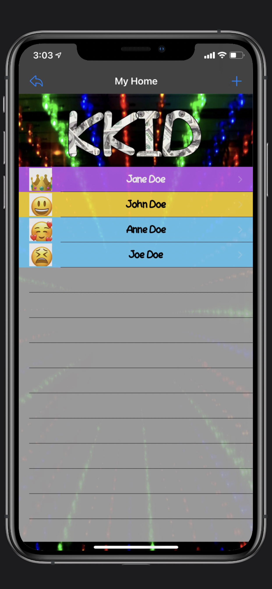
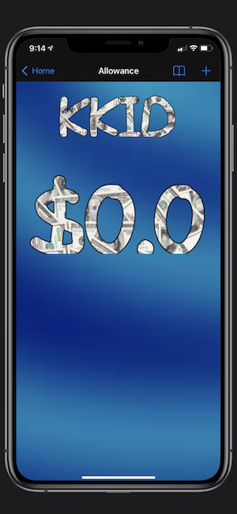
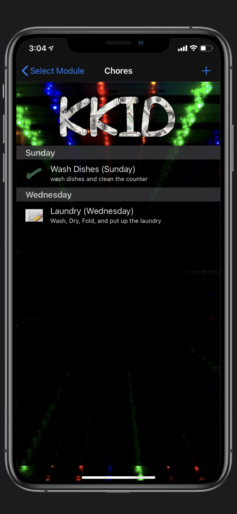

# KKid
KKid is an app for parents and their children to keep up with chores and allowance. With this app parents can create child accounts and add chores to their profile. Kids can then login and see their chores and mark them off each day. By turning on the allowance feature parents can add/subtract money from the kid's allowance account (this is a virtual "account" to show the kids how much allowance they have, no money is actually exchanged within the KKid app, think of it as a notebook) and the kids can view this when they login as well.

## Screenshots
| Home Screen| Image Picker | Create Meme | Share Meme |
| ----------------- |  ----------------- | ----------------- | ----------------- |
|  |   |   |   |   | 

## Frameworks Used
Foundation
UIKit
CoreData
CoreText

## Third Party Frameworks Used
Alamofire-SwiftyJSON
Toast-Swift
SwiftyForm
ReachabilitySwift
SwiftMessages
Sync

## Instructions

### Login Screen:
On the login screen you can enter your username/email and password then click login to access the application.

#### If you need to create a new Master Parent (household) account you may click on "New Parent Account"

If you have forgotten your password you may enter your username in the username field and click "Forgot Password" and a reset link will be emailed to you.

After login you will be taken to the "Home" Screen

NOTE: Child accounts and additional parent accounts for an existing household must be created after logging in as the master user or an admin user.

DEMO Account
username: dev_kkid_master
password: LetmeN2it

- Home Screen (after login):
On the home screen you will see a list of users under your master (household) account.

If you are the master user (background on name will be purple) or an admin user (background on name will be gold/yellow) then you may add an additional user/kid/parent/admin by clicking the plus symbol in the upper right corner of the screen

Clicking the back button in the upper left will sign you out of the application.

Clicking on a user will take you to the "Select Module" screen for that user (NOTE: if you are not the master or an admin then you will only be able to select your own account from this list)

- 